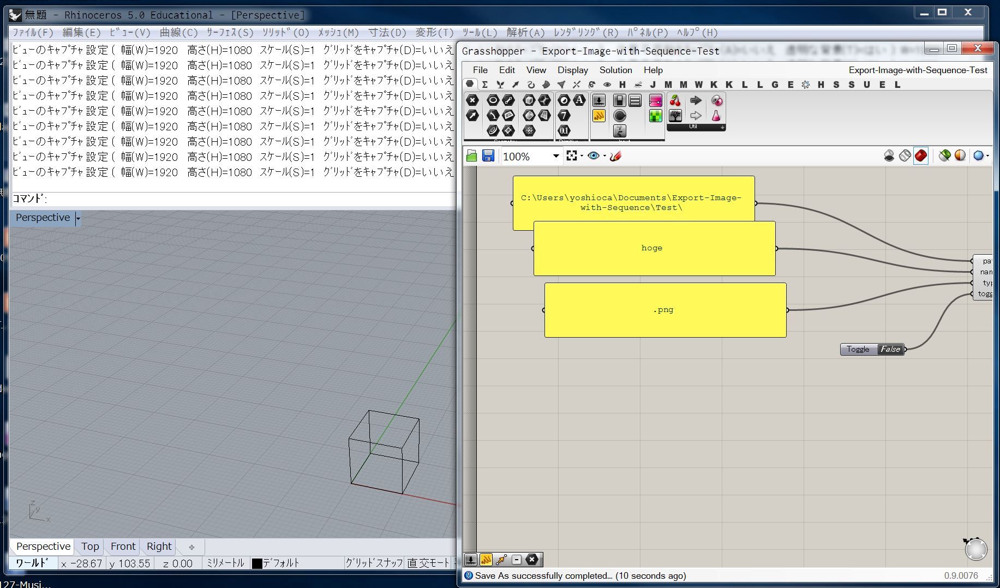
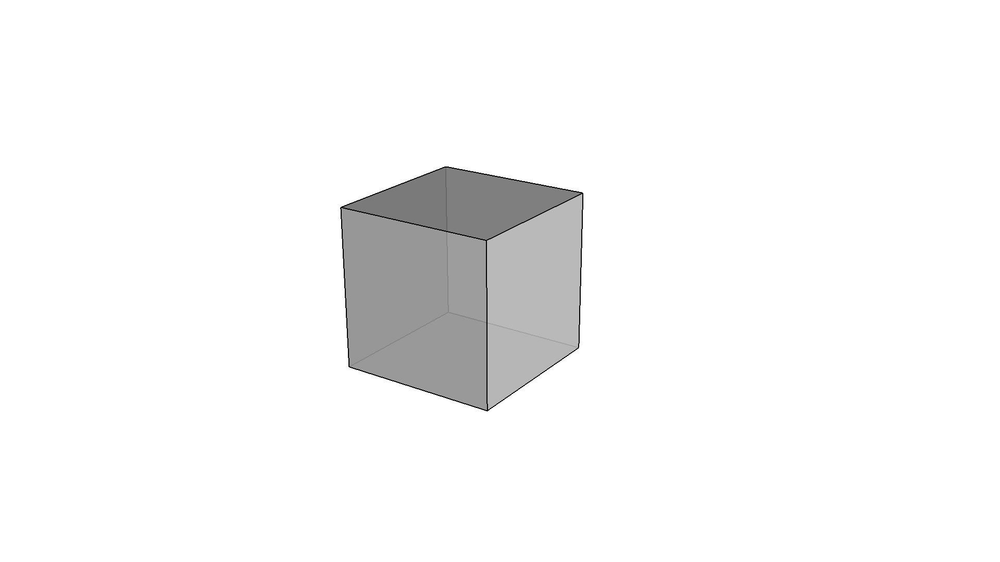
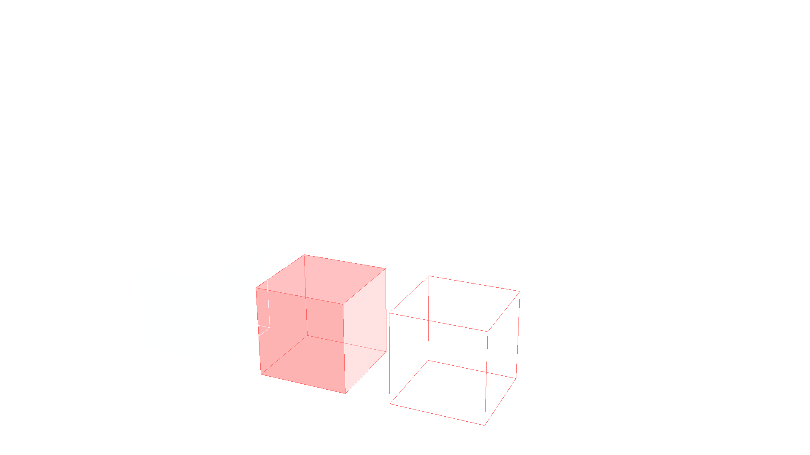
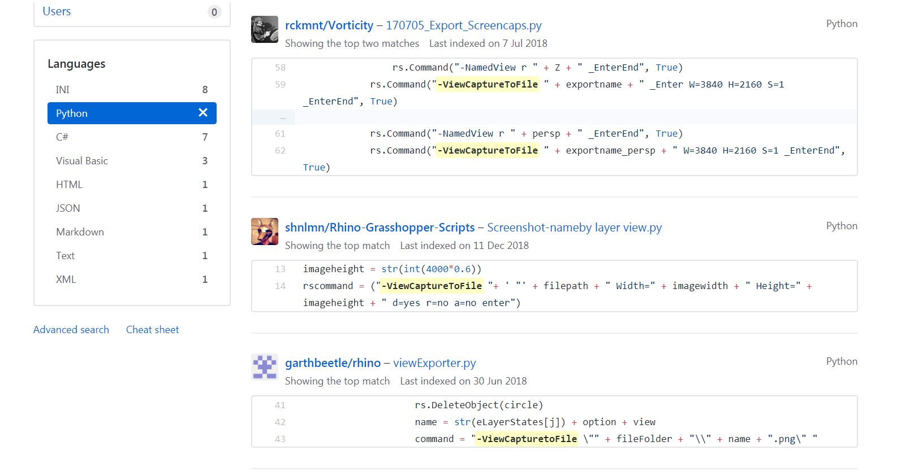

# Export-Image-with-Sequence  

Rhino + Grasshopper で、（連番の）画像を吐き出すスクリプト。  

Image Format  
JPG, PNG, TIF etc...  


---


### Capture Rhino Objects

  
↓  
  
  
  
ライノのオブジェクトの描画は、ビューポートの設定に依存する  


### Capture Grasshopper Objects  
  
CustomPreview にColourPicker で渡すと、一番左。ほとんど見えない。  
マテリアルかな


---  


### ViewCaptureToFile  

The ViewCaptureToFile command saves an image of the current view to a file.  


[http://docs.mcneel.com/rhino/5/help/en-us/commands/viewcapture.htm](http://docs.mcneel.com/rhino/5/help/en-us/commands/viewcapture.htm)  


見てみると、オプション実行についてちゃんとかいてあった。  

- Command-line options  
  - To access command-line options  
    - Type a hyphen in front of the command name: -ViewCaptureToFile.  

実行時にハイフンを付けると、オプション有りで実行と書いてあった。  


---  


### rs.Command("-ViewCaptureToFile")  


適当に GitHub で探すとなんかあった。  

  

[https://github.com/search?l=Python&q=-ViewCaptureToFile&type=Code](https://github.com/search?l=Python&q=-ViewCaptureToFile&type=Code)  


コマンドのオプションを、こういう感じで指定しているが、できない。  
```python
" d=yes r=no a=no "　# NG
```
大文字にしてもダメ。  
```python
" D=Yes R=No A=No "　# NG
```
オプション省略しなくてもダメ。
```python
" DrawGrid=Yes "　# NG
```


なんか他のスクリプト見ていたら、アンダーバーをはさんでいた。  
Enter などにも、アンダーバー付けてるのとそうでないのがあるので、よくわからない。  
```python
" D=_Yes R=_No A=_No "　# OK
```

前に、Make2D のときは、  
省略なしで、アンダーバーなしで書いて動いていたのでよくわからない。  
[https://github.com/naysok/AlgorithmicDesign-for-GraphicDesign/blob/master/Make2d-ExportAi-scripts/Make2d-ExportAiFile.md](https://github.com/naysok/AlgorithmicDesign-for-GraphicDesign/blob/master/Make2d-ExportAi-scripts/Make2d-ExportAiFile.md)


---  
